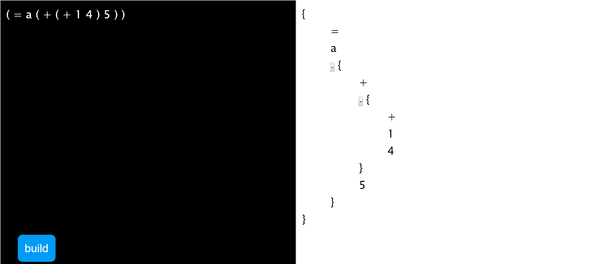

# TreeVisualization
Visualize tree in js

## usage
provide preorder traversal of a tree, build a tree using html.

### example

a = 1 + 4 + 5 can be treated as a syntax tree like this:
```
         =
        / \
        a  +
          / \
          +  +
         / \  5
         1  4
```

which means its preorder order traversal is like this:
```
( = a ( + ( + 1 4 ) 5 ) )
```




## notice
please make sure
* input has **balanced paren** (otherwise it will cause infinite loop for searching `)`, i should check input, but i am lazy...)
* root elememt always appears **first** after `(` (because input is preorder traversal of a tree!)
* every token should be seperated in **exactly one space**(i should use regex to match multiple space, but i am lazy...)  
